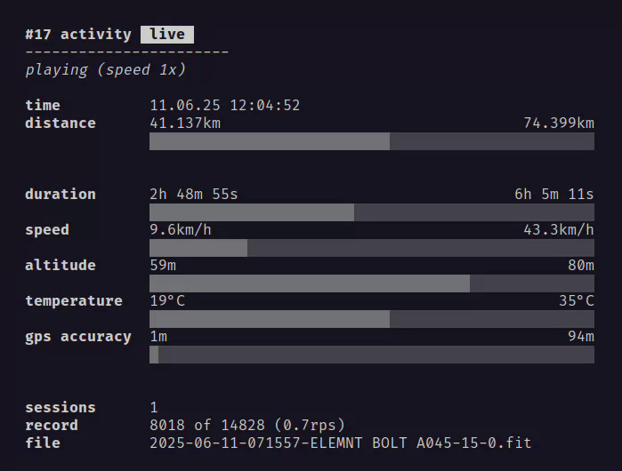

# fit-activities-tui

**Activities** of **[FIT](https://developer.garmin.com/fit/overview/)** ([Flexible and Interoperable Data Transfer](https://developer.garmin.com/fit/overview/)) files in your **terminal**.

Handles as much FIT files as you want: Summary, details, filter and sort. It's fast. Free and open source.

Works nice with [Wahoo Fitness](http://wahoofitness.com) devices. Tested with [ELEMNT BOLT 3](https://support.wahoofitness.com/hc/en-us/articles/26243351942290-ELEMNT-BOLT-3-2025-Product-Information).

Built with [Go](https://go.dev), [Bubble Tea](https://github.com/charmbracelet/bubbletea/) and ♥.

# Table of Contents

- [Preview](./#preview)
- [CLI](./#cli)
- [Keybindings](./#keybindings)
- [Installation](./#installation)
- [Development](./#development)
- [License](./#license)

# Preview

## Summary

<a href="demo/demo.gif">
  
</a>

## Review live data (real time)

<a href="demo/live-data.gif">
  
</a>

# CLI

```sh
fit-activities-tui --help
Usage:
  fit-activities-tui [flags]

Flags:
  -h, --help            help for fit-activities-tui
  -i, --import string   path to FIT file, directory, or glob pattern (e.g., '*.fit', 'dir/*_walk-*.fit'). Patterns must be in quotes; use full paths only (no shorthands)
      --log             enable logging to store logs into 'debug.log'
```

# Keybindings

## Menu

| Key | Description |
| --- | --- |
| <kbd>m</kbd> | Toggle menu |

## Actions

| Key | Description |
| --- | --- |
| <kbd>l</kbd> | toggle live data |
| <kbd>ctrl+alt+r</kbd> | re-import file(s) |
| <kbd>q</kbd> | quit |

In `live data` view

| Key | Description |
| --- | --- |
| <kbd>SPACE</kbd> | toggle play / pause |
| <kbd>r</kbd> | reset current record count |
| <kbd>ctrl+r</kbd> | reset all record counts |

## List

| Key | Description |
| --- | --- |
| <kbd>↑</kbd> | previous activity |
| <kbd>↓</kbd> | next activity |
| <kbd>g</kbd> | first activity |
| <kbd>G</kbd> | last activity |
| <kbd>←</kbd> or <kbd>→</kbd> | switch pages |

## Filter

| Key | Description |
| --- | --- |
| <kbd>/</kbd> | start filter |
| <kbd>ENTER</kbd> | apply filter |
| <kbd>ESC</kbd> | cancel filter |

## Sort

| Key | Description |
| --- | --- |
| <kbd>ctrl+d</kbd> | sort by distance |
| <kbd>ctrl+t</kbd> | sort by start time |

## Live data

| Key | Description |
| --- | --- |
| <kbd>l</kbd> | show / hide |
| <kbd>SPACE</kbd> | play / pause |
| <kbd>r</kbd> | reset current record count |
| <kbd>ctrl+r</kbd> | reset all record counts |

While `playing`

| Key | Description |
| --- | --- |
| <kbd>1-9</kbd> | 1-9x speed |
| <kbd>0</kbd> | 10x speed |
| <kbd>right</kbd> | increase speed |
| <kbd>ctrl+right</kbd> | fast forward (ffw) |
| <kbd>left</kbd> | decrease speed |


While `paused`

| Key | Description |
| --- | --- |
| <kbd>right</kbd> | next record |
| <kbd>ctrl+right</kbd> | fast forward (ffw) records |
| <kbd>left</kbd> | previous record |
| <kbd>ctrl+left</kbd> | rewind (rwd) records |

# Installation

TBD

# Development

## Requirements

### Nix users (recommend)

`cd` into root directory.

If you have [`direnv`](https://direnv.net) installed, run `direnv allow` once to install dependencies. In other case run `nix develop`.

### Non Nix users

- [`Go`](https://go.dev/doc/install)
- [`Staticcheck`](https://staticcheck.dev)
- [`just`](https://just.systems)


```sh
just
Available recipes:
    default  # list commands

    [demo]
    demo     # Build an animated `demo.gif`. Run this command with $IMPORT_PATH={directory-of-FIT-files} defined to point to FIT files you want to use for the demo. [alias: d]

    [dev]
    run path # Runs the app by importing FIT files from given path. [alias: r]
```

### Build

TBD


# License

[MIT License](./LICENSE)
