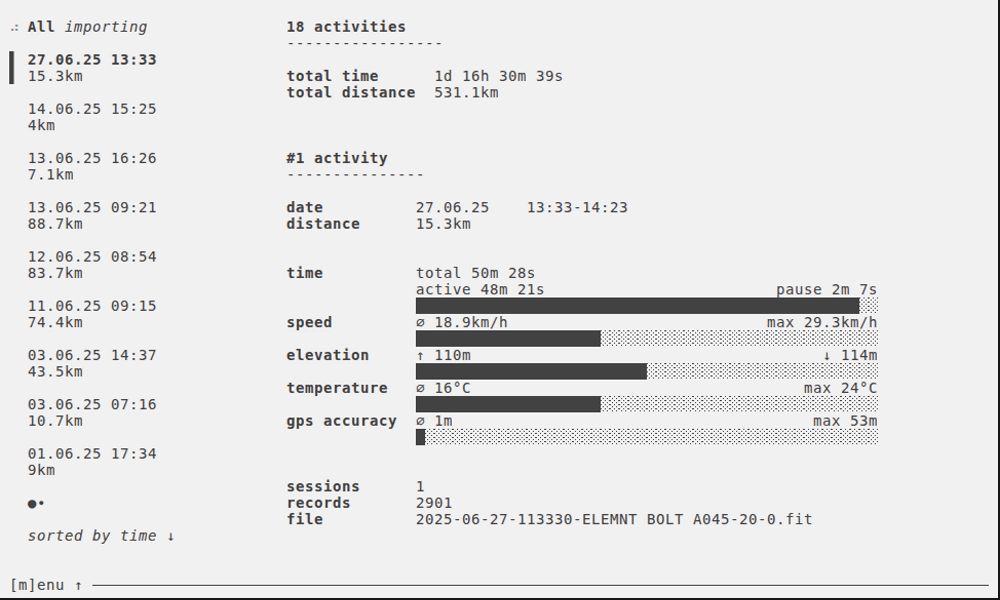

# fit-activities-tui

Activities of [`FIT` (Flexible and Interoperable Data Transfer)](https://developer.garmin.com/fit/overview/) files in your terminal.

Works nice with Wahoo devices. Tested with ELEMNT BOLT 3.

# Table of Contents

- [Preview](./#preview)
- [CLI](./#cli)
- [Keybindings](./#keybindings)
- [Installation](./#installation)
- [Development](./#development)
- [License](./#license)

# Preview

<a href="demo/demo.gif">
  
</a>

# CLI

```sh
fit-activities-tui --help
Usage:
  fit-activities-tui [flags]

Flags:
  -h, --help            help for fit-activities-tui
  -i, --import string   path to single FIT file or directory of FIT files to import
      --log             enable logging to store logs into 'debug.log'
```

# Keybindings

## Menu

| Key | Description |
| --- | --- |
| <kbd>m</kbd> | Toggle menu |

## List

| Key | Description |
| --- | --- |
| <kbd>↑</kbd> | prev. activity |
| <kbd>↓</kbd> | next activity |
| <kbd>g</kbd> | first activity |
| <kbd>G</kbd> | last activity |
| <kbd>← or →</kbd> | switch pages |

## Filter

| Key | Description |
| --- | --- |
| <kbd>/</kbd> | start filter |
| <kbd>ENTER</kbd> | apply filter |
| <kbd>ESC</kbd> | cancel filter |

## Sort

| Key | Description |
| --- | --- |
| <kbd>^d</kbd> | sort by distance |
| <kbd>^t</kbd> | sort by start time |


## Actions

| Key | Description |
| --- | --- |
| <kbd>r</kbd> | reload data |
| <kbd>q</kbd> | quit |

# Installation

TBD

# Development

## Requirements

### Nix users (recommend)

`cd` into root directory.

If you have [`direnv`](https://direnv.net) installed, run `direnv allow` once to install dependencies. In other case run `nix develop`.

### Non Nix users

- [`Go`](https://go.dev/doc/install)
- [`Staticcheck`](https://staticcheck.dev)
- [`just`](https://just.systems)


```sh
just
Available recipes:
    default  # list commands

    [demo]
    demo     # Build an animated `demo.gif`. Run this command with $IMPORT_PATH={directory-of-FIT-files} defined to point to FIT files you want to use for the demo. [alias: d]

    [dev]
    run path # Runs the app by importing FIT files from given path. [alias: r]
```

### Build

TBD


# License

[MIT License](./LICENSE)
